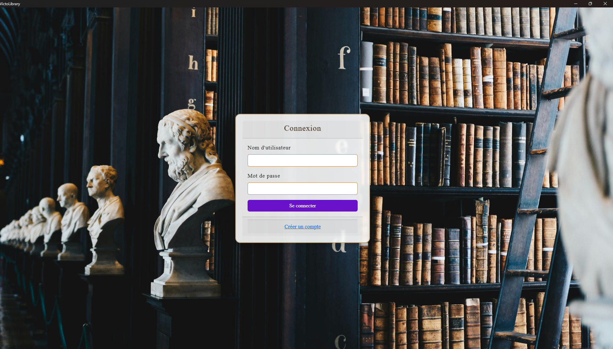
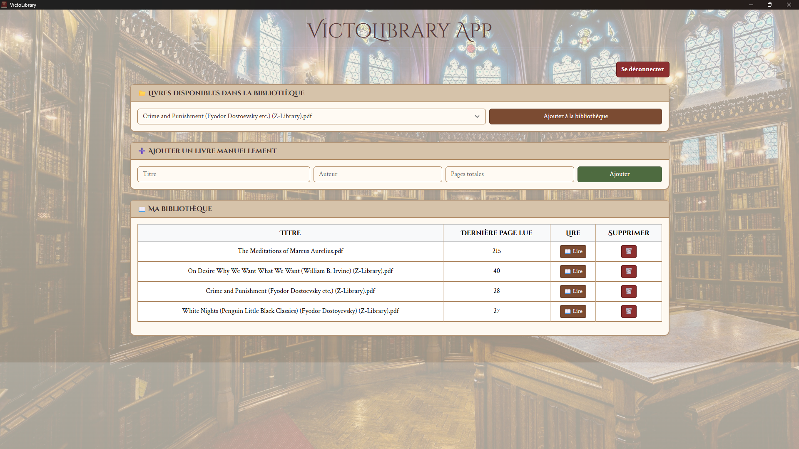

# VictoLibrary

A personal library manager with a Victorian reading-room aesthetic — track your books, pick up reading where you left off, and use it as a website or as a native desktop app.

#### Video Demo: https://youtu.be/ODeW2yje4jE
#### GitHub: [rachidbr6](https://github.com/rachidbr6)
#### edX: [rachidbr666](https://profile.edx.org/u/rachidbr666)
#### Location: Rabat, Morocco
#### Date: August 16, 2025

## Screenshots

| Login | Library dashboard |
|---|---|
|  |  |

## Description

VictoLibrary is a library management application that can be used both as a web application and as a standalone desktop program. It lets you organize your personal book collection, track reading progress page by page, and manage your account through a simple, elegant interface.

The application combines a Flask backend with a MySQL database, and runs either in a browser or as a desktop app (via PyWebview) with its own window and icon.

## Features

**Book management**
- Add books manually (title, author, total pages) or pick them up automatically from PDFs dropped in `static/books/`
- View your whole collection in a structured table
- Update your current page to track reading progress
- Mark books as favorites
- Remove books you no longer need

**User accounts**
- Register with a username and password
- Passwords are hashed with Werkzeug's `generate_password_hash` / `check_password_hash`
- Session-based login required before accessing the library

**Desktop integration**
- Launch as a native window (no browser chrome) via PyWebview
- Custom window icon and title
- One-click launch from a desktop shortcut

## Tech stack

| Layer | Technology |
|---|---|
| Backend | Flask (Python) |
| Database | MySQL |
| Frontend | HTML, CSS, Bootstrap 5 |
| Desktop shell | PyWebview (WebView2 on Windows) |

## Project structure

```
VictoLibrary/
├── app.py                # Main Flask application (routes, logic, DB operations)
├── launch_app.pyw        # Desktop launcher: starts the server and opens a native window
├── run_desktop.py        # Alternative PyWebview launcher
├── library.sql           # MySQL schema and seed data
├── requirements.txt      # Python dependencies
├── VictoLibrary.bat      # Windows launcher (runs launch_app.pyw silently)
├── static/
│   ├── books/             # Your PDF/EPUB books (not tracked in git)
│   ├── screenshots/       # Images used in this README
│   ├── logo.ico
│   ├── styles.css
│   └── styles1.css
└── templates/
    ├── index.html         # Main interface (book list, add/update/delete forms)
    ├── login.html         # Login page
    └── register.html      # Registration page
```

## Getting started

### 1. Clone the repository

```bash
git clone https://github.com/rachidbr6/Victolibrary-.git
cd Victolibrary-
```

### 2. Install dependencies

```bash
pip install -r requirements.txt
```

### 3. Set up the database

Start a local MySQL server (default connection used by the app: `host=localhost`, `user=root`, no password), then create the database and load the schema:

```bash
mysql -u root -e "CREATE DATABASE library CHARACTER SET utf8mb4 COLLATE utf8mb4_general_ci"
mysql -u root library < library.sql
```

If you'd rather start from an empty library, you can skip `library.sql` — `app.py` creates the required tables automatically on first run.

### 4. Add your books (optional)

Drop PDF files into `static/books/` — they'll appear in the "available books" dropdown so you can add them to your library with one click.

### 5. Run it

**As a website**

```bash
python app.py
```

Then open http://127.0.0.1:5000 in your browser.

**As a desktop app**

```bash
python launch_app.pyw
```

This starts the Flask server in the background (if it isn't already running) and opens VictoLibrary in its own native window. On Windows, double-click `VictoLibrary.bat` — or the desktop shortcut, if you've created one — to do the same silently.

## Database schema

**books**

| Column | Type | Notes |
|---|---|---|
| id | INT | Primary key, auto-increment |
| title | VARCHAR(255) | Required |
| author | VARCHAR(255) | Optional |
| total_pages | INT | Optional |
| current_page | INT | Default 1 |
| is_favorite | BOOLEAN | Default false |

**users**

| Column | Type | Notes |
|---|---|---|
| id | INT | Primary key, auto-increment |
| username | VARCHAR(50) | Unique, required |
| password | VARCHAR(255) | Hashed, required |

## Design decisions

- **Flask** was chosen for its simplicity and tight integration with Python.
- **MySQL** was chosen over SQLite for better scalability and stability as the collection grows.
- **Bootstrap 5** provides a clean, responsive layout without reinventing basic UI components.
- **PyWebview** lets the same Flask app run as a native desktop app, improving accessibility without a separate frontend stack.

### Aesthetic choice: Victorian vibe

VictoLibrary is not only a functional project but also a reflection of a personal inspiration. Its design draws on the Victorian era — refinement, elegance, and a timeless passion for literature — to recreate the feeling of an old reading room while running on modern technology.

## Future improvements

- Book cover thumbnails
- In-app PDF/EPUB reader instead of external viewers
- Categories and tags for organizing collections
- Reading statistics and history tracking
- Multi-user libraries (separate collections per account)
